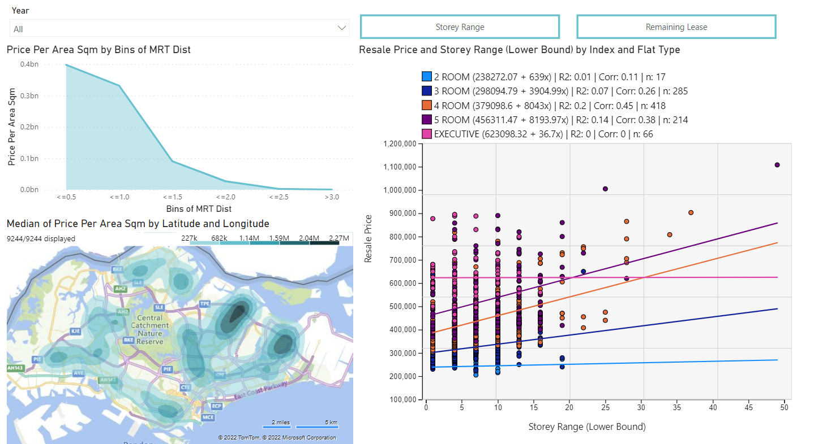

# Singapore Housing Price Analysis
 
I wanted to see how affordable housing is across countries, but I couldn't find a properly documented and easily downloaded dataset hence I created one with the help of web-scraping with Python and Pandas. 
  
Date: February 2021  
Video Demo: https://vimeo.com/user122233488/review/678118497/1c3104daa4 
Full Documentation: https://github.com/jolenechong/SingaporeHousingPriceAnalysis/blob/master/Documentation.pdf  

## Scope
We were tasked to create a visualisation that helps our target users find out if Singapore is a good place to live/work in based on different factors. 

Through this project, I set out to answer questions with the help of multiple datasets available on the internet and showcased my skills in web-scraping with Python, data cleaning, manipulation, analysis and visualisation. 

## Overview of Reports
  
<strong>Resale Price By Location and Lease.</strong> For the first report, I decided to cover how resale price is impacted by location and lease. To give users a quick overview, I used a heat map visualisation to show median price per area square which shows that the Punggol-Sengkang, West and Central tend to have more expensive housing. Then, I used the line graph to demonstrate how as distance to nearest MRT increases, Price per area Square decreases, showing to target users that MRT distance heavily impacts Housing Price. I also wanted to see how other factors like Storey Range and Remaining Lease impact Resale Price as I heard that higher stories are more expensive so I wanted to see if it was true with the help of Linear Regression. We can see that for 3 ROOM 4 ROOM and 5 ROOM flats, there is a high correlation between Storey range and Resale price with the correlation values of 0.26, 0.45 and 0.38 respectively, showing to users that if they plan on getting these housing types, they would have to take into consideration storey range as part of their decision. Users can then click on the button to see the relationship between remaining lease and resale price, which will allow them to see that a lower remaining lease does result in cheaper housing though the correlation is not as strong.
   

  
<strong>Resale Price Analysis By Type and Town.</strong> On my second report, covering the analysis of resale price based on type and town. I found the best way to display the information was with a decomposition tree which allows users to see which types of units tend to be more expensive and for those types of units, which town would be more expensive. Then, I forecasted resale pricing trends for 2022 to see if there’s an increase, which will allow target users to decide when it’s most suitable to get a house in 2022. I also added the visual showing maximum, average and minimum trends. This would likely mean to users that even though resale prices may seem like it's increasing but compared to the maximum, the average and minimum have been relatively constant. Lastly, I made use of the key influences analysis to see which are the key influences towards housing price that I might have missed out. For example, we can see that to get cheaper housing, target users can look for 2 ROOM flats, flats in Sembawang and Woodlands etc.
   

  
<strong>Housing markets globally.</strong> For my third report, I’ve decided to compare housing markets globally.  I also used KPI visuals to show the exact ranking of Singapore among the 502 cities which shows that Singapore is not very affordable overall. However, different countries have different standards of living, environment and many other different factors. Hence, I decided to let users choose the countries they want to compare. Using a slicer for the cities included in this dataset, target users are able to quickly easily compare cities they want in terms of Price to Income ratio which is also formatted to show less affordable markets to be darker. For example, as seen, Hong Kong, Beijing, Seoul, Moscow and Paris have less affordable housing than Singapore while Tokyo, Ankara, Washington and Chennai have more affordable housing. With this, target users will get a better idea of how Singapore’s housing market compares to cities around the world. From what we see here, Singapore’s housing market is satisfactory in terms of affordability compared to other First World countries’ capitals like the capitals of China, Russia and France.
   

## Tech Stack
- PowerBI
- Python (Used in loading data and webscraping*)
- Python Libraries: pandas, requests, BeautifulSoup
- Checkout documentation pdf for source of datasets

*To see more about how I did webscraping click [here](https://github.com/jolenechong/SingaporeHousingPriceAnalysis/tree/main/global%20housing%20price%20index%20webscraping)

## Contact
Jolene - [jolenechong7@gmail.com](mailto:jolenechong7@gmail.com)  
